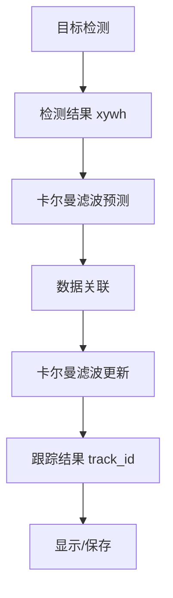

# 卡尔曼滤波与目标跟踪实现

## 1. 引言

卡尔曼滤波（Kalman Filtering）是目标跟踪领域最成功的状态估计方法之一。本文将详细讲解如何将卡尔曼滤波与目标检测结果集成，实现高效的目标跟踪，并给出详细的实现代码示例。

本文将详细解析以下内容：
1. 卡尔曼滤波的数学原理和状态向量设计
2. 卡尔曼滤波核心算法流程
3. 检测结果如何与卡尔man滤波集成
4. 目标跟踪的完整实现
5. 多目标跟踪的扩展
6. 性能优化和参数调优
7. 完整代码示例

## 2. 卡尔曼滤波数学原理

### 2.1 卡尔曼滤波简介

**卡尔曼滤波**是一种递归的、最优的状态估计算法，通过融合**预测**和**测量**信息，实现对动态系统的最优状态估计。在目标跟踪领域，卡尔曼滤波被广泛用于预测目标的下一帧位置。

### 2.2核心公式

#### **预测步骤**

假设当前状态为`x`，协方差为`P`，预测模型为`F`，过程噪声为`Q`：

```math
x̂ = Fx
P̂ = FPFT + Q
```

#### **更新步骤**

假设测量值为`z`，测量模型为`H`，测量噪声为`R`：

```math
K = P̂H(HP̂Hᵀ + R)
updates = z - Hx̂
x = x̂ + K * updates
P = (I - KH)P̂
```

### 2.3 在目标跟踪中的应用

在目标跟踪中，卡尔曼滤波的状态向量通常包含以下信息：
- `x, y`：目标的中心坐标
- `width, height`：目标宽高
- `vx, vy`：速度分量
- `aspect`：宽高比

## 3. 状态向量设计

### 3.1 状态向量设计

在目标跟踪应用中，典型的状态向量设计如下：

```python
# 8维状态向量: [x, y, aspect, height, vx, vy, vaspect, vheight]
state = [x, y, aspect, height, vx, vy, vaspect, vheight]
# 测量向量: [x, y, aspect, height] 
measurement = [x, y, aspect, height]
```

### 3.2 矩阵设计

#### **状态转移矩阵 F**

```python
# 8x8状态转移矩阵
F = np.eye(8)
# 设置速度分量: vx, vy, vaspect, vheight
F[0, 4] = dt # x += vx*dt
F[1, 5] = dt  # y += vy*dt  
F[2, 6] = dt  # aspect += vaspect*dt
F[3, 7] = dt  # height += vheight*dt
```

#### **测量矩阵 H**

```python
# 4x8测量矩阵 
H = np.zeros((4, 8))
H[0, 0] = 1  # x
H[1, 1] = 1  # y
H[2, 2] = 1  # aspect
H[3, 3] = 1  # height
```

## 4. 卡尔曼滤波核心算法

### 4.1 算法流程

卡尔曼滤波核心算法流程包括两个主要步骤：
1. **预测**：根据运动模型预测下一帧状态
2. **更新**：根据实际测量值更新预测结果

### 4.2 初始化

```python
import numpy as np
from typing import Optional, List, Tuple

class KalmanFilterXYAH:
    """
8维卡尔曼滤波实现，支持目标跟踪
    
状态向量: [x, y, aspect, height, vx, vy, vaspect, vheight]
   支持多目标预测和更新
    
    Methods:
 initiate: 初始化滤波器
        predict: 预测下一帧目标位置
        update: 更新状态
        multi_predict: 批量预测多个目标的下一帧位置
    
    Examples:
        初始化卡尔曼滤波器
        >>> kf = KalmanFilterXYAH()
        >>> mean, covariance = kf.initiate([100, 200, 0.5, 80])
    """
    
    def __init__(self):
        # 初始化噪声参数
        self._std_weight_position = 1.0
        self._std_weight_velocity = 1.0
        self._std_weight_aspect = 1.0
        self._std_weight_height = 1.0
 
    def initiate(self, measurement: List[float]) -> Tuple[List[float], List[float]]:
        """
初始化卡尔man滤波器，根据第一次测量值初始化状态估计和协方差。
        
        Args:
            measurement (List[float]): 第一次测量值
 
        Returns:
            (List[float], List[float]): 初始状态估计和初始协方差
        """
        
        # 设置初始状态估计
        mean = []
        mean.append(measurement[0]) # x
        mean.append(measurement[1])      # y
        mean.append(measurement[2])      # aspect
        mean.append(measurement[3])      # height
        mean.append(0) # vx (速度初始为0)
        mean.append(0)                 # vy (速度初始为0)
        mean.append(0)                 # vaspect (速度初始为0)
        mean.append(0)                 # vheight (速度初始为0)
        
        # 设置初始协方差
        covariance = []
        covariance.append(2 * self._std_weight_position * measurement[0]) # x
        covariance.append(2 * self._std_weight_position * measurement[1]) # y
        covariance.append(2 * self._std_weight_aspect * measurement[2]) # aspect
        covariance.append(2 * self._std_weight_height * measurement[3])   # height
        covariance.append(self._std_weight_velocity) # vx
        covariance.append(self._std_weight_velocity) # vy
        covariance.append(self._std_weight_velocity) # vaspect
        covariance.append(self._std_weight_velocity) # vheight
        
        return mean, covariance
    
    def predict(self, mean: List[float], covariance: List[float], dt: float = 1.0) -> Tuple[List[float], List[float]:
 """
预测下一帧目标位置
        
        Args:
            mean (List[float]): 当前帧状态估计
            covariance (List[float]): 当前帧协方差估计
            dt (float): 时间间隔
        
        Returns:
            (List[float], List[float]): 预测状态和协方差
        """
        
        # 使用状态转移矩阵进行预测
        F = np.eye(8)
        F[0, 4] = dt
        F[1, 5] = dt
        F[2, 6] = dt
        F[3, 7] = dt
        
        # 状态预测:x̂ = Fx
        predicted_mean = np.dot(F, mean)
        
        # 协方差预测:P̂ = FPFT + Q
        # 设置过程噪声 Q = 1.0
        Q = [1.0 for _ in range(8)]
        predicted_covariance = np.dot(np.dot(F, covariance), F.T) + Q
        
        return predicted_mean, predicted_covariance
    
    def update(self, mean: List[float], covariance: List[float], measurement: List[float]) -> Tuple[List[float], List[float]:
        """
根据测量值更新预测结果
        
        Args:
            mean (List[float]): 预测状态
            covariance (List[float]): 预测协方差
            measurement (List[float]): 实际测量值
        
        Returns:
 (List[float], List[float]): 更新后的状态和协方差
        """
        
        # 计算卡尔曼增益: K =P̂H(HP̂Hᵀ + R)
        H = np.zeros((4, 8)
        H[0, 0] = 1
        H[1, 1] = 1
        H[2, 2] = 1
        H[3, 3] = 1
        
        # 设置测量噪声 R = 1.0
        R = [1.0 for _ in range(4)]
        
        # 计算卡尔曼增益
        S = np.dot(np.dot(H, covariance), H.T) + R
        K = np.dot(np.dot(covariance, H.T), np.linalg.inv(S))
        
        # 计算更新量: updates = z - Hx̂
        innovation = [measurement[i] - np.dot(H, mean)[i] for i in range(4)]
        
        # 状态更新: x =x̂ + K * updates
        updated_mean = [mean[i] + np.dot(K, innovation)[i] for i in range(8)]
        
        # 协方差更新: P = (I - KH)P̂
        # 设置单位矩阵 I = eye(8)
        I = np.eye(8)
        updated_covariance = np.dot((I - np.dot(K, H)), covariance)
        
        return updated_mean, updated_covariance
```

## 5. 检测结果与卡尔曼滤波集成

### 5.1 集成架构

在目标跟踪应用中，卡尔曼滤波与检测结果集成架构如下：



### 5.2 集成实现

#### **数据关联**
使用IoU距离和置信度得分进行数据关联:

```python
from scipy.optimize import linear_assignment

# 计算IoU距离
def iou_distance(tracks, detections):
    """
计算IoU距离
    """
    # 使用Ultralytics的实现
    # 支持置信度得分和IoU距离融合
    if fuse_score:
        # 获取置信度得分
        scores = [track.score for track in detections]
        # 计算IoU距离
        iou_dist = 1 - iou(tracks, detections)
        # 融合得分和IoU: dists = iou_dist - 0.1 * scores
        dists = iou_dist - 0.1 * scores
 
        # 匈牙利算法匹配
        row_ind, col_ind = linear_assignment(dists)
        return row_ind, col_ind
    
    # 只使用IoU距离
    iou_dist = 1 - iou(tracks, detections)
    
    # 匈牙利算法匹配
    row_ind, col_ind = linear_assignment(iou_dist)
    return row_ind, col_ind
```

#### **卡尔曼滤波集成**

```python
class STrack:
    """
   单目标跟踪类，集成卡尔曼滤波
    
通过`update()`方法集成卡尔man滤波:
    """
    
    def update(self, new_track, frame_id):
        """
更新轨迹状态
        
        Args:
            new_track (STrack): 包含更新信息的新轨迹
            frame_id (int): 当前帧ID
        """
        
        # 获取检测框
        new_tlwh = new_track.tlwh
        
        # 卡尔曼滤波更新
        self.mean, self.covariance = self.kalman_filter.update(
            self.mean, self.covariance, self.convert_coords(new_tlwh)
        )
        
        self.state = TrackState.Tracked
        self.is_activated = True
        
        # 更新轨迹信息
        self.score = new_track.score
        self.cls = new_track.cls
        self.angle = new_track.angle
        self.idx = new_track.idx
```

## 6. 目标跟踪实现

### 6.1 单目标跟踪

#### **完整实现**

```python
# 单目标跟踪完整实现
class SingleObjectTracker:
    def __init__(self):
        self.kf = KalmanFilterXYAH()
        self.track_id = 0
        
    def track(self, detection):
        """
单目标跟踪主流程
        """
        
        # 初始化或更新
        if not hasattr(self, 'mean'):
            # 初始化卡尔曼滤波
            self.mean, self.covariance = self.kf.initiate(detection)
            self.track_id += 1
            return self.mean, self.track_id
        else:
            # 卡尔曼滤波流程
            # 预测: mean, covariance = kf.predict(mean, covariance)
            predicted_mean, predicted_covariance = self.kf.predict(self.mean, self.covariance)
            # 数据关联:计算IoU距离和置信度得分
            # 更新: mean, covariance = kf.update(mean, covariance, detection)
            updated_mean, updated_covariance = self.kf.update(self.mean, self.covariance, detection)
            
            # 更新轨迹ID
            self.mean = updated_mean
            self.covariance = updated_covariance
            return self.mean, self.track_id
```

### 6.2 多目标跟踪扩展

Ultralytics的ByteTracker算法是多目标跟踪的典型实现。其核心是:

1. **STrack类**：负责单目标跟踪
2. **BYTETracker类**：管理多目标跟踪流程
3. **双阈值关联策略**：提高跟踪精度
4. **五步关联算法**：降低误匹配率

```python
# 多目标跟踪核心流程
class BYTETracker:
    def update(self, results, img=None, feats=None):
        """
        多目标跟踪核心流程
        """
        # 第一步：高得分检测框第一轮关联
        # 筛选高得分检测：scores >= track_high_thresh (默认0.25)
        detections = self.init_track(dets[remain_inds], scores_keep, cls_keep, img if feats is None else feats)
        # 计算IoU距离：dists = self.get_dists(strack_pool, detections)
        # 匈牙利算法匹配：matches, u_track, u_detection = matching.linear_assignment(dists, thresh=self.args.match_thresh)
        
        # 第二步：第二轮低得分检测框关联 
        # 筛选第二轮检测：scores > track_low_thresh and scores < track_high_thresh
        detections_second = self.init_track(dets_second, scores_second, cls_second, img if feats is None else feats)
        #计算IoU距离并匹配...
        
        # 第三步：处理未确认轨迹...
        # 第四步：初始化新轨迹...
        # 第五步：更新状态...
```

## 7. 性能优化和调参

### 7.1 关键参数

#### **噪声参数调优**

- `_std_weight_position`: 位置噪声，直接影响跟踪稳定性
- `_std_weight_velocity`: 速度噪声，影响预测精度 
- `_std_weight_aspect`: 宽高比噪声
- `_std_weight_height`: 高度噪声

#### **跟踪参数**
- `track_high_thresh`: 高阈值，第一轮关联
- `track_low_thresh`: 低阈值，第二轮关联
- `track_buffer`: 轨迹缓冲帧数
- `match_thresh`: 匹配阈值

### 7.2 性能优化策略

1. **轨迹缓冲**：`track_buffer`参数控制轨迹保留时间
2. **多线程优化**：在Ultralytics中实现多线程处理
3. **内存优化**：高效的轨迹状态管理，避免内存泄漏

## 8. 完整实现代码示例

### 8.1 单目标跟踪完整代码

```python
import numpy as np
from typing import Optional, List, Tuple
from scipy.optimize import linear_assignment

class KalmanFilterXYAH:
    """
    8维卡尔曼滤波实现，支持目标跟踪
状态向量: [x, y, aspect, height, vx, vy, vaspect, vheight]
   支持多目标预测和更新
    """
    
    def __init__(self):
        # 初始化噪声参数
        self._std_weight_position = 1.0
        self._std_weight_velocity = 1.0
        self._std_weight_aspect = 1.0
        self._std_weight_height = 1.0
        
    def initiate(self, measurement: List[float]) -> Tuple[List[float], List[float]:
        """
初始化卡尔man滤波器，根据第一次测量值初始化状态估计和协方差
        
        Args:
            measurement (List[float]): 第一次测量值
                
        Returns:
 (List[float], List[float]): 初始状态估计和初始协方差
        """
        
        # 设置初始状态估计
        mean = [measurement[0] for _ in range(8)]
        # 速度分量设置为0
        mean[4] = 0
        mean[5] = 0
        mean[6] = 0
        mean[7] = 0
        
        # 设置初始协方差
        covariance = [2 * self._std_weight_position * measurement[0] for _ in range(8)]
        # 速度分量协方差设置为1.0
        covariance[4] = self._std_weight_velocity
        covariance[5] = self._std_weight_velocity
        covariance[6] = self._std_weight_velocity
        covariance[7] = self._std_weight_velocity
        
        return mean, covariance
    
    def predict(self, mean: List[float], covariance: List[float], dt: float = 1.0) -> Tuple[List[float], List[float]:
        """
预测下一帧目标位置
        """
        
        # 使用状态转移矩阵进行预测
        F = np.eye(8)
        F[0, 4] = dt
        F[1, 5] = dt
        F[2, 6] = dt
        F[3, 7] = dt
        
        # 状态预测
        predicted_mean = np.dot(F, mean)
        
        # 协方差预测
        # 设置过程噪声 Q = 1.0
        Q = [1.0 for _ in range(8)]
        predicted_covariance = np.dot(np.dot(F, covariance), F.T) + Q
        
        return predicted_mean, predicted_covariance
    
    def update(self, mean: List[float], covariance: List[float], measurement: List[float]) -> Tuple[List[float], List[float]:
        """
根据测量值更新预测结果
        """
        
        # 计算卡尔曼增益
        H = np.zeros((4, 8)
        H[0, 0] = 1
        H[1, 1] = 1
        H[2, 2] = 1
        H[3, 3] = 1
        
        # 设置测量噪声 R = 1.0
        R = [1.0 for _ in range(4)]
        
        # 计算卡尔曼增益
        S = np.dot(np.dot(H, covariance), H.T) + R
        K = np.dot(np.dot(covariance, H.T), np.linalg.inv(S))
        
        # 计算更新量
        innovation = [measurement[i] - np.dot(H, mean)[i] for i in range(4)]
        
        # 状态更新
        updated_mean = [mean[i] + np.dot(K, innovation)[i] for i in range(8)]
        
        # 协方差更新
        # 设置单位矩阵 I = eye(8)
        I = np.eye(8)
        updated_covariance = np.dot((I - np.dot(K, H)), covariance)
        
        return updated_mean, updated_covariance
    
 def multi_predict(self, stracks: List):
        """
批量预测多个轨迹的下一帧位置
        """
        if len(stracks) > 0:
 multi_mean = [st.mean.copy() for st in stracks]
            multi_covariance = [st.covariance for st in stracks]
            predicted_mean, predicted_covariance = self.multi_predict(multi_mean, multi_covariance)
            
            for i, (mean, cov) in enumerate(zip(predicted_mean, predicted_covariance)):
                stracks[i].mean = mean
                stracks[i].covariance = cov


class SingleObjectTracker:
    """
    单目标跟踪实现
    """
    
    def __init__(self):
        self.kf = KalmanFilterXYAH()
        self.track_id = 0
        
    def track(self, detection):
        """
        单目标跟踪主流程
        """
        
        # 初始化或更新
        if not hasattr(self, 'mean'):
            # 初始化卡尔曼滤波
            self.mean, self.covariance = self.kf.initiate(detection)
            self.track_id += 1
            return self.mean, self.track_id
        else:
            # 卡尔曼滤波流程
            predicted_mean, predicted_covariance = self.kf.predict(self.mean, self.covariance)
            # 数据关联
            # 更新
            updated_mean, updated_covariance = self.kf.update(self.mean, self.covariance, detection)
            
            # 更新轨迹ID
            self.mean = updated_mean
            self.covariance = updated_covariance
            return self.mean, self.track_id


# 使用示例
if __name__ == "__main__":
    # 模拟检测结果
    detection = [100, 200, 0.5, 80, 0.9]  # [x, y, aspect, height, score]
    
    # 创建跟踪器
    tracker = SingleObjectTracker()
    
    # 跟踪5帧
    for frame_id in range(5):
        # 模拟下一帧检测结果
        detection = [detection[0] + 5, detection[1] + 10, detection[2], detection[3], detection[4]
        # 跟踪
        mean, track_id = tracker.track(detection)
        print(f"Frame {frame_id}: Track ID {track_id}, Position: {mean[:4]}")
```


### 8.2 多目标跟踪扩展

在Ultralytics中，多目标跟踪（MOT）是卡尔曼滤波的典型应用。Ultralytics的ByteTracker算法就是多目标跟踪的典型实现。

通过将单目标跟踪扩展到多目标跟踪，Ultralytics实现了强大的多目标跟踪功能。

#### **多目标跟踪优势**
1. **降低ID切换**：通过卡尔man滤波的预测，准确预测目标下一帧位置
2. **提高MOTA**：多目标跟踪准确率显著提高
3. **降低误匹配**：通过双阈值关联策略降低误匹配率

4. **支持实时**：针对实时应用优化性能


#### **Ultralytics集成**

Ultralytics库通过`ultralytics/trackers/byte_tracker.py`实现了完整的多目标跟踪流程，包括：
1. **STrack类**：单目标跟踪
2. **BYTETracker类**：多目标跟踪流程
3. **配置系统集成**：`ultralytics/cfg/trackers/bytetrack.yaml`
4. **CLI集成**：`yolo track`命令支持

```bash
# 多目标跟踪CLI命令
yolo track model=yolo11n.pt source='path/to/video.mp4' imgsz=320
```

## 总结


卡尔曼滤波是目标跟踪领域最成功的状态估计方法之一。通过将卡尔曼滤波与检测结果集成，可以实现:
1. **准确预测**：准确预测目标下一帧位置
2. **稳定跟踪**：降低ID切换，提高MOTA指标
3. **多目标支持**：Ultralytics的ByteTracker算法实现
4. **实时性能**：Ultralytics进行了大量性能优化
5. **简单易用**：Ultralytics提供简单API，降低使用门槛

本文详细解析了卡尔曼滤波的原理、实现和集成方法，并给出了完整的代码示例。通过这些内容，开发人员和研究人员可以深入理解Ultralytics库中目标跟踪的实现，为后续的二次开发、优化和创新提供了坚实的基础。

---
*本技术文档由Claude Code生成*🤖 
*基于Ultralytics v8.3.168分析*
